# Agentic Engineering

## Agenda

1. What is Agentic Engineering?
2. The Evolution: Coding → Vibe Coding → Agentic Engineering
3. The Four Agentic Design Patterns
4. Agent Architecture: How Agents Work
5. Agentic Coding Tools Landscape
6. Agentic Frameworks for Developers
7. The Protocols: MCP and A2A
8. Best Practices
9. Risks & Challenges
10. The Developer's New Role
11. Demo: Multi-Agent Workflow with Semantic Kernel
12. Key Takeaways & Resources

---

## 1. What is Agentic Engineering?

**Agentic Engineering** is the practice of defining goals, constraints, and quality standards for AI agents, who then **autonomously plan, create, test, and refine** software and systems.

Instead of writing every line of code, engineers:

- 🎯 **Design workflows** and specify intentions
- 🤖 **Delegate tasks** to AI agents
- 🔍 **Review and validate** outputs
- 🔄 **Iterate** with structured oversight

### Key Characteristics

| Characteristic           | Description                                                           |
| ------------------------ | --------------------------------------------------------------------- |
| **Autonomy**             | Agents act with minimal intervention, handling multi-step workflows   |
| **Goal-Oriented**        | Engineers specify intentions and constraints, not procedural details  |
| **Iterative Validation** | Human oversight ensures outputs meet requirements                     |
| **Collaboration**        | Agents coordinate with each other and escalate to humans              |
| **Layered Oversight**    | Spectrum from suggestion to full workflow execution under supervision |

> 📖 Ref: [Glide — "What is Agentic Engineering?"](https://www.glideapps.com/blog/what-is-agentic-engineering) · [Kilo.ai — Agentic Engineering](https://path.kilo.ai/introduction/what-is-agentic-engineering/)

---

## 2. The Evolution: Coding → Vibe Coding → Agentic Engineering

The way we build software has been transforming rapidly:

```mermaid
flowchart LR
    A["🖥️ Traditional\nCoding\n2020-2022"] --> B["🤖 AI-Assisted\nCoding\n2023"]
    B --> C["🎵 Vibe Coding\n(Karpathy)\n2024"]
    C --> D["⚙️ Agentic\nEngineering\n2025-2026"]
```



### Key Milestones

- **2021** — GitHub Copilot technical preview (AI autocomplete enters mainstream)
- **2024** — Andrej Karpathy coins **"Vibe Coding"** — "give in to the vibes," accept AI suggestions with minimal scrutiny
- **2025** — Limitations of vibe coding surface — compounded bugs, chaotic codebases
- **2025-2026** — **Agentic Engineering** emerges — from accepting suggestions to orchestrating fleets of AI agents

### Comparison

|            | Traditional Coding   | Vibe Coding                 | Agentic Engineering                   |
| ---------- | -------------------- | --------------------------- | ------------------------------------- |
| Human Role | Writes code directly | Prompts AI, accepts output  | Orchestrates agents, reviews, manages |
| AI Role    | Suggests/assists     | Generates code autonomously | Plans, codes, tests, iterates         |
| Oversight  | Full                 | Partial                     | Structured, layered                   |
| Output     | Deterministic        | Stochastic, varied          | Goal-oriented, quality-controlled     |
| Risk       | Human bottleneck     | Errors, lack of rigor       | Oversight, governance                 |

> 📖 Ref: [Forbes — "From Vibe Coding to Agentic Engineering"](https://www.forbes.com/councils/forbestechcouncil/2025/08/21/from-vibe-coding-to-agentic-engineering-redefining-sdlc-with-one-pizza-teams/) · [Morph LLM — "The 2026 Paradigm Shift"](https://www.morphllm.com/blog/vibe-coding-to-agentic-engineering)

---

## 3. The Four Agentic Design Patterns

Andrew Ng (DeepLearning.AI) identified **four foundational design patterns** that make AI agents far more capable than single-shot prompting:

### 🔁 Pattern 1: Reflection

The agent **critiques, evaluates, and iteratively improves** its own output.


- Code generators that review and debug their own code
- Even simpler models, when used with reflection, **outperform advanced models** used without it

### 🔧 Pattern 2: Tool Use

Agents access **external tools** — APIs, databases, web search, code execution — extending beyond the LLM's built-in knowledge.

- Research agents that search the web for up-to-date information
- Agents that execute code, query databases, or interact with business software

### 📋 Pattern 3: Planning

Decompose a complex problem into a **sequence of actionable steps**, then execute them — adjusting dynamically as new information emerges.

- Break a project into: requirements → design → implementation → testing
- Dynamic replanning when intermediate steps fail

### 👥 Pattern 4: Multi-Agent Collaboration

Distribute tasks among **multiple specialized agents** that interact, debate, critique, and combine their efforts.

- "Planner" + "Coder" + "Reviewer" + "Integrator" agent teams
- Debate systems where agents argue opposing sides to reach consensus

> 📖 Ref: [Andrew Ng — Sequoia AI Ascent 2024](https://octetdata.com/blog/notes-andrew-ng-agentic-reasoning-2024/) · [DeepLearning.AI — Agentic AI Patterns](https://github.com/madeeha96/agentic-ai) · [Continuum Labs — Andrew Ng's presentation](https://training.continuumlabs.ai/agents/what-is-agency/andrew-ngs-presentation-on-ai-agents)

---

## 4. Agent Architecture: How Agents Work

At their core, AI agents follow a **Perceive → Plan → Act → Reflect** loop:

```mermaid
flowchart TD
    P["🔍 Perceive\nContext, tools, user input"]
    PL["📋 Plan\nDecompose goals into steps"]
    A["⚡ Act\nExecute tools, generate output"]
    R["🔁 Reflect\nEvaluate results, improve"]

    P --> PL --> A --> R
    R -. loop .-> P
```



### Memory Systems

| Type                       | Purpose                   | Example                                        |
| -------------------------- | ------------------------- | ---------------------------------------------- |
| **Short-term (Working)**   | Current task context      | Conversation history, current plan             |
| **Long-term (Persistent)** | Knowledge across sessions | Embeddings, vector stores, learned preferences |
| **Episodic**               | Past experiences          | Previous task outcomes, error patterns         |

### Key Principle: Bounded Autonomy

Agents are **not fully autonomous**. They operate within defined boundaries:

- What tools they can use
- What actions require human approval
- When to escalate vs. proceed independently

> 📖 Ref: [Google Cloud — "What is Agentic AI?"](https://cloud.google.com/discover/what-is-agentic-ai) · [arxiv — "Agentic Software Engineering: Foundational Pillars"](https://arxiv.org/pdf/2509.06216)

---

## 5. Agentic Coding Tools Landscape

The tools we use to write software are becoming **agentic** — moving from autocomplete to autonomous coding:

| Tool                     | Best For          | Standout Feature                              | Autonomy  |
| ------------------------ | ----------------- | --------------------------------------------- | --------- |
| **GitHub Copilot Agent** | Teams, compliance | Tightest IDE integration (VS Code, JetBrains) | High      |
| **Cursor**               | Complex projects  | Multi-file refactor, AI-native IDE            | High      |
| **Windsurf**             | Enterprises       | Cascade engine, auto linter fixes             | High      |
| **Claude Code**          | DevOps, CLI users | Deep code reasoning, terminal-based           | High      |
| **Devin**                | Full automation   | End-to-end autonomous engineer                | Very High |
| **OpenAI Codex**         | CLI power-users   | Multi-modal CLI, open models                  | Moderate  |

### What Makes Them "Agentic"?

Unlike traditional autocomplete, these tools can:

- ✅ **Plan** multi-step changes across files
- ✅ **Execute** code, run tests, read errors
- ✅ **Iterate** — fix their own mistakes based on test/lint output
- ✅ **Use tools** — terminal, browser, file system
- ✅ **Reflect** — evaluate their output and improve it

> 📖 Ref: [aistatus.org — "Best Agentic Coding Tools"](https://aistatus.org/best-agentic-coding-tools) · [aiagents.bot — "Best AI Coding Assistants"](https://aiagents.bot/blog/best-ai-coding-assistants-2025)

---

## 6. Agentic Frameworks for Developers

Four major frameworks dominate the agentic AI space:

### LangGraph (LangChain)

- **Graph-based state machine** architecture for stateful, cyclical workflows
- Enterprise-ready: error handling, checkpointing, durable execution
- Used by Klarna, Uber, Replit
- ⚠️ Steep learning curve

### AutoGen (Microsoft)

- **Conversation-driven** multi-agent system
- Agents delegate tasks and communicate through dialogue
- Great for rapid prototyping of multi-agent capabilities

### CrewAI

- **Role-based team** paradigm — each agent specializes in a skill
- Centralized task delegation and coordination
- Lower token usage and latency in benchmarks

### Semantic Kernel (Microsoft)

- **Plugin/skill architecture** for enterprise integration
- Composable connectors for existing APIs and business processes
- Production-grade orchestration, logging, monitoring

### Comparison

| Framework           | Architecture               | Best For                      | Learning Curve |
| ------------------- | -------------------------- | ----------------------------- | -------------- |
| **LangGraph**       | Graph-based state machines | Production, complex workflows | Steep          |
| **AutoGen**         | Conversation-driven        | Multi-agent prototyping       | Moderate       |
| **CrewAI**          | Role-based teams           | Structured collaboration      | Easy           |
| **Semantic Kernel** | Plugin/skill-based         | Enterprise integration        | Moderate       |

> 📖 Ref: [Turing — "AI Agent Frameworks"](https://www.turing.com/resources/ai-agent-frameworks) · [arxiv — "Agentic AI Frameworks: Architectures, Protocols"](https://arxiv.org/html/2508.10146v1) · [mem0.ai — "Agentic Frameworks Guide"](https://mem0.ai/blog/agentic-frameworks-ai-agents)

---

## 7. The Protocols: MCP and A2A

Two open protocols are standardizing how agents connect to the world and to each other:

### MCP — Model Context Protocol (Anthropic, Nov 2024)

> "The USB port for AI" — a universal way for LLMs to connect to external data, tools, and services.

```mermaid
flowchart LR
    C["🤖 AI Client\n(Claude, etc)"] <-- "JSON-RPC 2.0" --> S["🔧 MCP Server\n(Tools/Data)"]
```



- **Resources** — structured data (documents, DB rows)
- **Tools** — executable functions (APIs, scripts)
- **Prompts** — workflow templates
- Inspired by the **Language Server Protocol** (LSP)
- Adopted by OpenAI, Google DeepMind; donated to the **Linux Foundation**

### A2A — Agent-to-Agent Protocol (Google, 2025)

> Enables secure, interoperable communication **between agents**, regardless of vendor or framework.

```mermaid
flowchart LR
    A["🤖 Agent A\n(Any vendor)"] <-- "A2A Protocol" --> B["🤖 Agent B\n(Any vendor)"]
```



- **Agent Cards** — JSON capability manifests at well-known endpoints
- **Tasks** — formal lifecycle: submitted → working → completed/failed
- **Opaque execution** — agents don't expose internal state
- 150+ partners; governed by the **Linux Foundation**

### MCP vs A2A — Complementary, Not Competing

| Aspect       | MCP                                                                       | A2A                                      |
| ------------ | ------------------------------------------------------------------------- | ---------------------------------------- |
| **Focus**    | Agent ↔ Tools/Data                                                        | Agent ↔ Agent                            |
| **Purpose**  | Give an agent access to external capabilities                             | Let agents collaborate across boundaries |
| **Analogy**  | USB port (connect peripherals)                                            | Network protocol (connect computers)     |
| **Together** | MCP enriches each agent's capabilities; A2A lets those agents collaborate |

> 📖 Ref: [Anthropic — "Introducing the Model Context Protocol"](https://www.anthropic.com/news/model-context-protocol) · [Google Developers Blog — "Announcing A2A"](https://developers.googleblog.com/en/a2a-a-new-era-of-agent-interoperability/) · [Galileo — "A2A Protocol Explained"](https://galileo.ai/blog/google-agent2agent-a2a-protocol-guide)

---

## 8. Best Practices for Agentic Engineering

### 🔒 Identity & Scope

- Treat each agent as a **distinct, non-human principal**
- Assign narrow, well-defined roles and permissions
- Avoid over-privileged service accounts

### 🎯 Bounded Autonomy

- Limit actions agents can take **without human approval**
- Especially for high-risk or business-impacting operations
- Implement logging and rationale-tracking for significant actions

### 👁️ Observability & Traceability

- Embed robust monitoring to track agent actions and outputs
- Maintain **full audit logs** for investigation and improvement
- Know what your agents are doing at all times

### 🛡️ Policy Enforcement at Boundaries

- Shift from "prompt engineering" to **hard controls** at boundaries
- Where agents interact with identities, tools, data, and output
- Regularly review and enforce boundary policies

### 👤 Human-in-the-Loop

- For high-stakes or regulated domains, **maintain human oversight**
- The EU AI Act may mandate human oversight for certain applications
- Design escalation paths for edge cases

### 🔄 Lifecycle Vigilance

- Address risks throughout the **entire lifecycle**: development, training, deployment, operation
- Not just during initial deployment

> 📖 Ref: [MIT Technology Review — "From Guardrails to Governance"](https://www.technologyreview.com/2026/02/04/1131014/from-guardrails-to-governance-a-ceos-guide-for-securing-agentic-systems/) · [McKinsey — "Deploying Agentic AI with Safety and Security"](https://www.mckinsey.com/capabilities/risk-and-resilience/our-insights/deploying-agentic-ai-with-safety-and-security-a-playbook-for-technology-leaders) · [IBM — Agentic AI Security Guide](https://www.ibm.com/think/insights/agentic-ai-security)

---

## 9. Risks & Challenges

### ⚠️ Hallucination & Misalignment

- Agents can **make mistakes** (hallucinate outputs) or misinterpret goals
- Especially dangerous when agents take **real-world actions** based on wrong conclusions
- Requires output verification and feedback loops

### 🔓 Cybersecurity Threat Surfaces

- Agents are **"digital insiders"** — if compromised, system-wide impact
- Expands attack surfaces beyond simple prompt injection
- Must anticipate insider-style attacks (intentional or unintentional)

### 🧩 Orchestration Complexity

- Multiple agents working in concert → ensuring consistent behavior is hard
- Avoiding conflicts and securing multi-agent workflows grows harder at scale
- Need formal coordination protocols

### ⚖️ Legal & Ethical Risks

- Misaligned output can create **significant liability**
- Privacy violations, bias, regulatory infractions
- Organizations can be held liable for agent errors

### 📋 Governance Gaps

- Many organizations **lack mature frameworks** for agent governance
- No clear inventories of deployed agents and their privileges
- OWASP released **Top 10 Risks for Agentic AI** in December 2025

> 📖 Ref: [MIT Sloan — "Agentic AI, explained"](https://mitsloan.mit.edu/ideas-made-to-matter/agentic-ai-explained) · [Deloitte — "Agentic AI Orchestration & Governance"](https://www.deloitte.com/us/en/what-we-do/capabilities/applied-artificial-intelligence/articles/agentic-ai-orchestration-governance.html) · [OWASP — "Top 10 Risks for Agentic AI"](https://genai.owasp.org/2025/12/09/owasp-genai-security-project-releases-top-10-risks-and-mitigations-for-agentic-ai-security/) · [IAPP — "AI Governance in the Agentic Era"](https://iapp.org/resources/article/ai-governance-in-the-agentic-era)

---

## 10. The Developer's New Role

The role of a software developer is **not disappearing** — it's **evolving**:

### From Code Writer → Orchestrator


### Skills to Develop

| Traditional Skill | Agentic Equivalent                        |
| ----------------- | ----------------------------------------- |
| Writing code      | Designing agent workflows                 |
| Debugging         | Evaluating agent outputs                  |
| Code review       | Agent output validation                   |
| Architecture      | System-of-agents design                   |
| Testing           | Defining quality constraints & guardrails |

### "One Pizza Teams" with AI Agents

- Small teams (2-3 humans) + AI agents as team members
- Humans set strategy, agents execute
- **The engineer who can effectively orchestrate AI agents will be 10x more productive**

> 📖 Ref: [Forbes — "From Vibe Coding to Agentic Engineering: Redefining SDLC"](https://www.forbes.com/councils/forbestechcouncil/2025/08/21/from-vibe-coding-to-agentic-engineering-redefining-sdlc-with-one-pizza-teams/)

---

## 11. Demo: Multi-Agent Workflow with Semantic Kernel

A .NET console application demonstrating the **Multi-Agent Collaboration** pattern:

### Three Agents Working Together

```mermaid
flowchart TD
    I["📝 User Input:\nWrite a short article about Kubernetes"]
    R["📚 Researcher\nGathers key facts and talking points"]
    W1["✍️ Writer\nDrafts the article based on research"]
    Rev["🔍 Reviewer\nCritiques the draft, suggests improvements"]
    W2["🔄 Writer\nRevises based on feedback (reflection)"]

    I --> R --> W1 --> Rev --> W2
```



### Patterns Demonstrated

- ✅ **Multi-Agent Collaboration** — three specialized agents
- ✅ **Planning** — Researcher decomposes the topic
- ✅ **Reflection** — Reviewer critiques, Writer improves
- ✅ **Tool Use** — Semantic Kernel plugin architecture

```bash
cd demo/AgenticDemo
dotnet run
```

---

## 12. Key Takeaways

| #   | Takeaway                                                                                           |
| --- | -------------------------------------------------------------------------------------------------- |
| 1   | Agentic Engineering is the **next evolution** beyond vibe coding — from prompting to orchestrating |
| 2   | Andrew Ng's **4 patterns** (Reflection, Tool Use, Planning, Multi-Agent) are the building blocks   |
| 3   | Agents follow a **Perceive → Plan → Act → Reflect** loop with bounded autonomy                     |
| 4   | **MCP** (Anthropic) connects agents to tools; **A2A** (Google) connects agents to each other       |
| 5   | Frameworks like **Semantic Kernel**, LangGraph, AutoGen, and CrewAI make it practical              |
| 6   | Coding tools (Copilot Agent, Cursor, Windsurf) are **already agentic**                             |
| 7   | **Best practices**: bounded autonomy, observability, human-in-the-loop, policy enforcement         |
| 8   | **Risks are real**: hallucination, security, governance — OWASP published Top 10 for Agentic AI    |
| 9   | The developer's role is **evolving**, not disappearing — from writer to orchestrator               |

---

## Resources

### Articles & Reports
- 📖 [MIT Sloan — "Agentic AI, explained"](https://mitsloan.mit.edu/ideas-made-to-matter/agentic-ai-explained)
- 📖 [McKinsey — "Deploying Agentic AI with Safety and Security"](https://www.mckinsey.com/capabilities/risk-and-resilience/our-insights/deploying-agentic-ai-with-safety-and-security-a-playbook-for-technology-leaders)
- 📖 [Forbes — "From Vibe Coding to Agentic Engineering"](https://www.forbes.com/councils/forbestechcouncil/2025/08/21/from-vibe-coding-to-agentic-engineering-redefining-sdlc-with-one-pizza-teams/)
- 📖 [Glide — "What is Agentic Engineering?"](https://www.glideapps.com/blog/what-is-agentic-engineering)
- 📖 [IBM — Agentic AI Security Guide](https://www.ibm.com/think/insights/agentic-ai-security)

### Academic Papers
- 📄 [arxiv — "Agentic Software Engineering: Foundational Pillars and a Research Roadmap"](https://arxiv.org/pdf/2509.06216)
- 📄 [Springer — "Agentic AI: a comprehensive survey of architectures"](https://link.springer.com/article/10.1007/s10462-025-11422-4)
- 📄 [arxiv — "Agentic AI Frameworks: Architectures, Protocols, and Design Challenges"](https://arxiv.org/html/2508.10146v1)

### Protocols & Frameworks
- 🔗 [Anthropic — Model Context Protocol (MCP)](https://www.anthropic.com/news/model-context-protocol)
- 🔗 [Google — Agent-to-Agent Protocol (A2A)](https://developers.googleblog.com/en/a2a-a-new-era-of-agent-interoperability/)
- 🔗 [Microsoft — Semantic Kernel](https://learn.microsoft.com/en-us/semantic-kernel/overview/)
- 🔗 [OWASP — Top 10 Risks for Agentic AI](https://genai.owasp.org/2025/12/09/owasp-genai-security-project-releases-top-10-risks-and-mitigations-for-agentic-ai-security/)

### Talks & Courses
- 🎥 [Andrew Ng — Sequoia AI Ascent 2024: Agentic Reasoning](https://octetdata.com/blog/notes-andrew-ng-agentic-reasoning-2024/)
- 🎓 [DeepLearning.AI — Agentic AI Patterns Course](https://github.com/madeeha96/agentic-ai)

### Demo
- 🔧 [Demo Project → `./demo/AgenticDemo`](./demo/AgenticDemo/)
